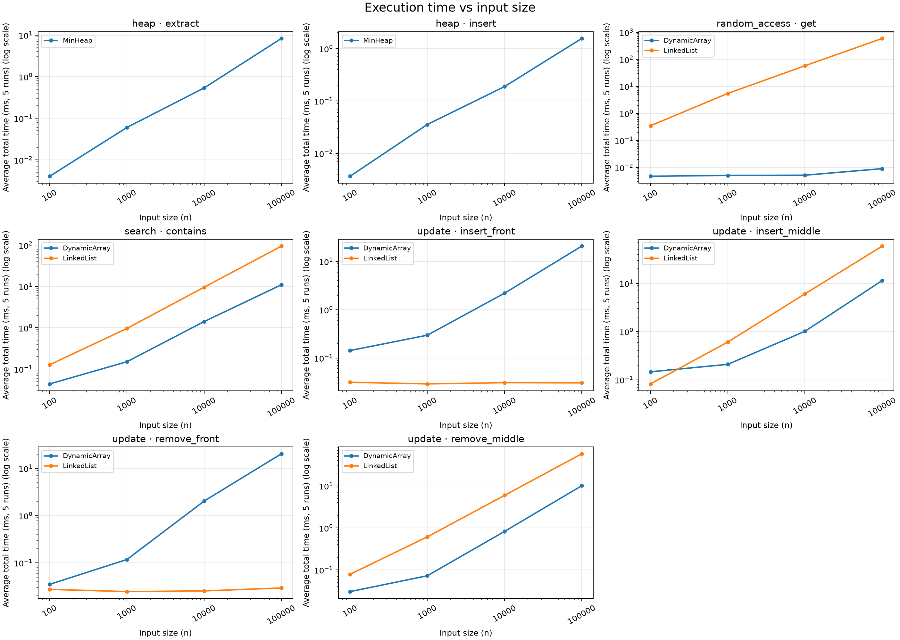
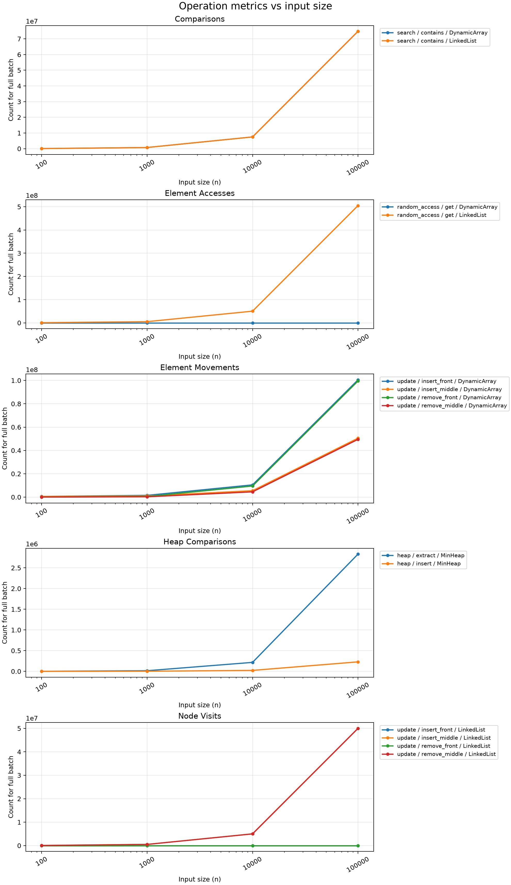

# Assignment 2: Data Structures

## 1. Overview

I implemented a Dynamic Array, a singly Linked List, and a Min-Heap in Java. They store `int` values. The array keeps values in one backing array, the list connects nodes, and the heap keeps the smallest value at the root. I use Java collections only in the tests to check my results.

## 2. Complexity Analysis

Here `n` is the current number of elements. `Θ(f(n))` gives a tight bound, so it also gives an upper bound `O(f(n))` and a lower bound `Ω(f(n))`. Best, average, and worst describe different cases of an operation. For averages below, indices are chosen uniformly; half of search queries miss and half find a value at a uniformly chosen position. The best case for append or heap insertion assumes spare capacity.

### Dynamic Array

| Operation | Best | Average | Worst | Extra space |
| --- | --- | --- | --- | --- |
| `add(x)` | `Θ(1)` | `Θ(1)` amortized | `Θ(n)` on resize | `Θ(1)`, or `Θ(n)` on resize |
| `add(index, x)` | `Θ(1)` | `Θ(n)` | `Θ(n)` | `Θ(1)`, or `Θ(n)` on resize |
| `remove(index)` | `Θ(1)` | `Θ(n)` | `Θ(n)` | `Θ(1)` |
| `get(index)` | `Θ(1)` | `Θ(1)` | `Θ(1)` | `Θ(1)` |
| `contains(x)` | `Θ(1)` | `Θ(n)` | `Θ(n)` | `Θ(1)` |

`get(index)` reads one position. Inserting or removing near the front shifts many values. Appending usually takes constant time, but copying into a larger array costs `Θ(n)` when it is full. Over many appends, that copying averages to `Θ(1)` per call (amortized).

### Linked List

| Operation | Best | Average | Worst | Extra space |
| --- | --- | --- | --- | --- |
| `add(x)` | `Θ(1)` | `Θ(1)` | `Θ(1)` | `Θ(1)` |
| `add(index, x)` | `Θ(1)` | `Θ(n)` | `Θ(n)` | `Θ(1)` |
| `remove(index)` | `Θ(1)` | `Θ(n)` | `Θ(n)` | `Θ(1)` |
| `get(index)` | `Θ(1)` | `Θ(n)` | `Θ(n)` | `Θ(1)` |
| `contains(x)` | `Θ(1)` | `Θ(n)` | `Θ(n)` | `Θ(1)` |

I keep a `tail` reference, so `add(x)` does not need a traversal. Adding or removing at the front is also constant time. For an index in the middle, the list must follow links from `head`. Removing the last node is linear because this singly linked list must find the node before it.

### Min-Heap

| Operation | Best | Average | Worst | Extra space |
| --- | --- | --- | --- | --- |
| `insert(x)` | `Θ(1)` | expected `Θ(1)`* | `Θ(log n)`, or `Θ(n)` on resize | `Θ(1)`, or `Θ(n)` on resize |
| `peekMin()` | `Θ(1)` | `Θ(1)` | `Θ(1)` | `Θ(1)` |
| `extractMin()` | `Θ(1)` | expected `Θ(log n)`* | `Θ(log n)` | `Θ(1)` |

The heap has about `log₂ n` levels. `peekMin()` reads the root, while insertion may move up and extraction may move down one path. A full backing array also has to grow during some insertions. *The average figures assume random distinct priorities; the cost of resizing is averaged over many insertions.*

## 3. Correctness: Loop Invariants

### Dynamic Array: `add(index, x)`

**Invariant:** At the start of a shift-loop iteration with position `i`, elements before `i` still have their original values, and elements after `i` have already shifted right by one.

**Initialization:** The loop starts at the old `size`. Nothing has shifted yet. If more capacity was needed, the old values were copied unchanged.

**Maintenance:** `elements[i] = elements[i - 1]` copies a value that has not moved yet. Decreasing `i` makes the shifted part one position larger, so the invariant stays true.

**Termination:** `i - index` decreases on each iteration. At `i = index`, the old suffix has shifted right and the prefix is unchanged. Writing `x` at `index` and increasing `size` gives exactly the requested insertion, including insertion at the end.

### Linked List: `contains(x)`

**Invariant:** Before checking `current`, none of the nodes already visited contains `x`, and `current` is the next node to check.

**Initialization:** `current` starts at `head`; no nodes have been checked.

**Maintenance:** If `current.value == x`, returning `true` is correct. Otherwise this node does not match, and moving to `current.next` keeps the invariant true.

**Termination:** Each unsuccessful step moves to the next node in a finite list. When `current` becomes `null`, every node has been checked, so returning `false` is correct. Therefore the method returns `true` exactly when `x` is in the list.

## 4. Experimental Setup

I used `n = 100, 1000, 10000, 100000`, seed `42`, and five measured runs per case. Random access uses `m = 10000` gets; search uses `m = 1000` queries (500 present, 500 absent); each update case uses `m = 1000`; the heap inserts and extracts `n` values. The array and list receive the same values and queries. I warmed up the JVM before measuring. `System.nanoTime()` measures only the operation loops, and the reported milliseconds are for the **whole batch**, averaged over five runs. Input generation and structure construction are outside the timer.

The metrics count: one array access per `get`, nodes visited from `head` for list access, checked values for `contains`, shifts and resize copies for array updates, visited existing nodes for list updates, and value comparisons inside heap insertion/extraction. I calculated the array/list counts from the exact indices and loop lengths; the heap counts use a counter in `MinHeap`.

The assignment asks for 1000 removals from the original structure, which is impossible when `n = 100`. I remove as many as possible at the fixed index, rebuild the original structure **outside** the timed section, and continue until 1000 removals are done. At `n = 100`, this takes 10 batches at the front and 20 in the middle; at `n = 1000`, middle removal takes 2 batches. The `n` in the tables is the initial size of each batch.

## 5. Results

Times below are average milliseconds for a complete batch. The tables show rounded values; [summary.csv](results/tables/summary.csv) has full precision, all metrics, and the theoretical bounds. [runs.csv](results/tables/runs.csv) has the five raw times for every case.

### Random access (`m = 10000`)

| n | Array ms | Array accesses | List ms | List accesses | Theory (array / list) |
| ---: | ---: | ---: | ---: | ---: | --- |
| 100 | 0.0048 | 10,000 | 0.352 | 511,327 | `Θ(m)` / `Θ(mn)` |
| 1,000 | 0.0051 | 10,000 | 5.506 | 5,021,262 | `Θ(m)` / `Θ(mn)` |
| 10,000 | 0.0052 | 10,000 | 58.119 | 50,180,278 | `Θ(m)` / `Θ(mn)` |
| 100,000 | 0.0091 | 10,000 | 595.426 | 504,938,617 | `Θ(m)` / `Θ(mn)` |

### Search (`m = 1000`)

They make the same number of comparisons because they scan the same values in the same order.

| n | Comparisons (each) | Array ms | List ms | Theory (both) |
| ---: | ---: | ---: | ---: | --- |
| 100 | 75,248 | 0.0438 | 0.127 | `Θ(mn)` |
| 1,000 | 740,750 | 0.151 | 0.966 | `Θ(mn)` |
| 10,000 | 7,487,908 | 1.417 | 9.608 | `Θ(mn)` |
| 100,000 | 74,802,381 | 10.973 | 94.851 | `Θ(mn)` |

### Insertion and removal (`m = 1000`)

Each cell is `ms / count`: array count means element movements; list count means node visits.

| Operation | n | Array ms / movements | List ms / node visits | Theory (array / list) |
| --- | ---: | ---: | ---: | --- |
| Insert at 0 | 100 | 0.143 / 601,420 | 0.031 / 0 | `O(mn+m²)` / `Θ(m)` |
| Insert at 0 | 1,000 | 0.297 / 1,500,524 | 0.029 / 0 | `O(mn+m²)` / `Θ(m)` |
| Insert at 0 | 10,000 | 2.201 / 10,499,500 | 0.031 / 0 | `O(mn+m²)` / `Θ(m)` |
| Insert at 0 | 100,000 | 20.778 / 100,499,500 | 0.031 / 0 | `O(mn+m²)` / `Θ(m)` |
| Remove at 0 | 100 | 0.035 / 49,500 | 0.027 / 1,000 | `O(mn)` / `Θ(m)` |
| Remove at 0 | 1,000 | 0.118 / 499,500 | 0.025 / 1,000 | `O(mn)` / `Θ(m)` |
| Remove at 0 | 10,000 | 2.036 / 9,499,500 | 0.025 / 1,000 | `O(mn)` / `Θ(m)` |
| Remove at 0 | 100,000 | 20.385 / 99,499,500 | 0.029 / 1,000 | `O(mn)` / `Θ(m)` |
| Insert at `n/2` | 100 | 0.146 / 551,420 | 0.082 / 50,000 | `O(mn+m²)` / `Θ(mn)` |
| Insert at `n/2` | 1,000 | 0.209 / 1,000,524 | 0.605 / 500,000 | `O(mn+m²)` / `Θ(mn)` |
| Insert at `n/2` | 10,000 | 1.014 / 5,499,500 | 6.070 / 5,000,000 | `O(mn+m²)` / `Θ(mn)` |
| Insert at `n/2` | 100,000 | 11.440 / 50,499,500 | 59.314 / 50,000,000 | `O(mn+m²)` / `Θ(mn)` |
| Remove at `n/2` | 100 | 0.031 / 24,500 | 0.079 / 51,000 | `O(mn)` / `Θ(mn)` |
| Remove at `n/2` | 1,000 | 0.073 / 249,500 | 0.613 / 501,000 | `O(mn)` / `Θ(mn)` |
| Remove at `n/2` | 10,000 | 0.827 / 4,499,500 | 5.951 / 5,001,000 | `O(mn)` / `Θ(mn)` |
| Remove at `n/2` | 100,000 | 10.097 / 49,499,500 | 58.081 / 50,001,000 | `O(mn)` / `Θ(mn)` |

### Min-Heap (`m = n`)

Random inserts are usually cheaper because most inserted values stop after a few parent comparisons.

| n | Insert ms | Insert comparisons | Extract ms | Extract comparisons | Theory (both) |
| ---: | ---: | ---: | ---: | ---: | --- |
| 100 | 0.0037 | 207 | 0.0041 | 845 | `O(n log n)` |
| 1,000 | 0.0356 | 2,207 | 0.0603 | 14,988 | `O(n log n)` |
| 10,000 | 0.1882 | 22,785 | 0.5384 | 216,538 | `O(n log n)` |
| 100,000 | 1.5598 | 228,937 | 8.3015 | 2,831,440 | `O(n log n)` |





## 6. Discussion

As `n` grows, 10000 array gets stay near the same time, while list gets rise from `0.352` to `595.426` ms. The list must walk from `head` each time. Searches are linear for both: at `n = 100000` each did `74,802,381` comparisons, but the array took `10.973` ms and the list `94.851` ms. Contiguous array storage and pointer chasing have different constant costs even with the same Big-O bound.

At the front, list updates barely change with `n`, while array updates must shift values. In the middle, the list has to traverse `n/2` nodes for every operation; at `n = 100000`, its insertion time was `59.314` ms versus `11.440` ms for the array. The small-`n` update points are affected by the fixed 1000 insertions, array resizing, and the removal batches described above. Tiny times also vary with JVM compilation, caching, and system activity, so I compare overall trends rather than every adjacent point.

Heap extraction grows faster than insertion: at `n = 100000` it made about `2.83` million comparisons, versus about `0.23` million for insertion. This fits movement down a heap of logarithmic height. `peekMin()` only reads the root, so its `Θ(1)` cost does not need a separate timed workload here.

## 7. Design Recommendations

- Use the dynamic array for frequent indexed reads and for searches when scanning is needed.
- Use this linked list when inserts and removals happen at the front. Its indexed operations still have to walk through nodes.
- Use the min-heap when repeatedly processing the smallest priority. It gives a fast minimum lookup and logarithmic worst-case update paths.

## 8. Conclusion and Running the Code

The best choice depends on the operations: arrays suit indexed access, linked lists suit front updates, and heaps suit priorities. The measured counts explain the main timing trends, while memory layout explains some differences that Big-O alone does not show.

`Tests.java` checks empty structures, duplicates, invalid indices, large inputs, heap order, and results against Java collections. The following commands compile, test, rerun the benchmark, and redraw the plots (the last command needs Python with matplotlib):

```text
javac -d out src/DynamicArray.java src/LinkedList.java src/MinHeap.java src/Benchmark.java src/Tests.java
java -cp out Tests
java -cp out Benchmark
python scripts/plot_results.py results/tables/summary.csv --output-dir results/plots
```
